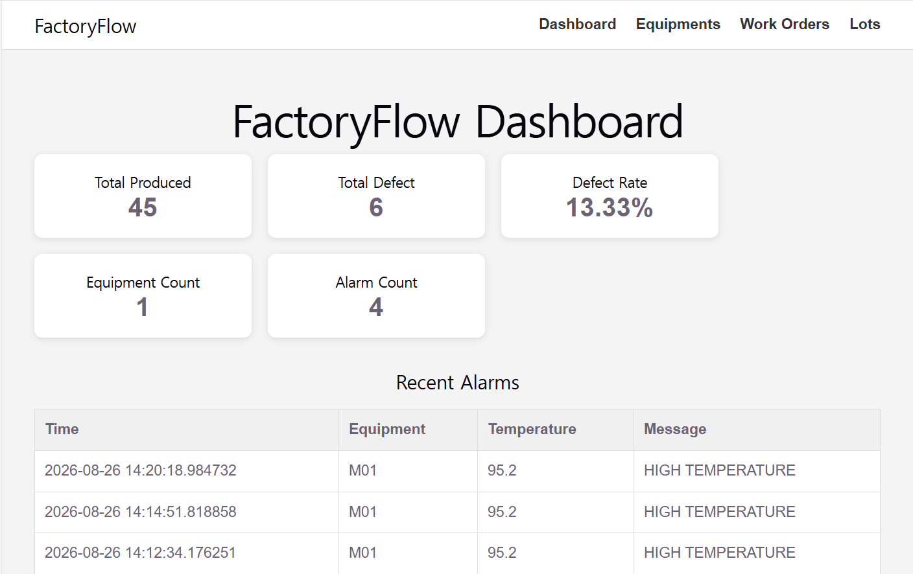
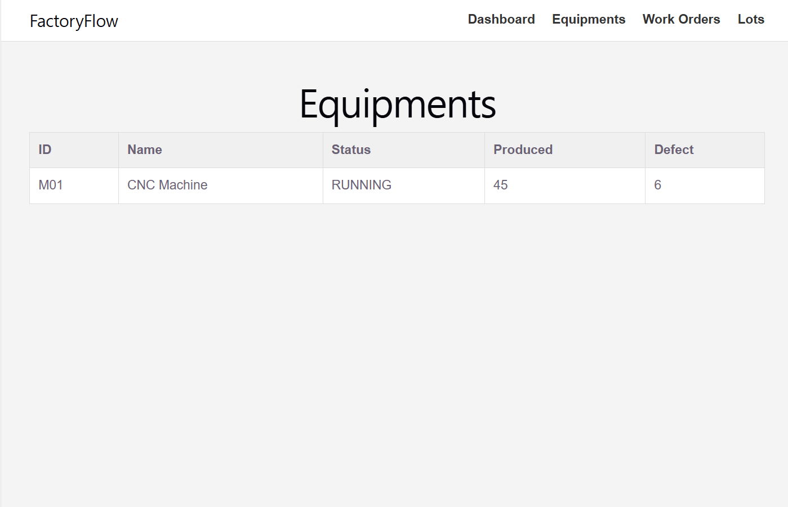
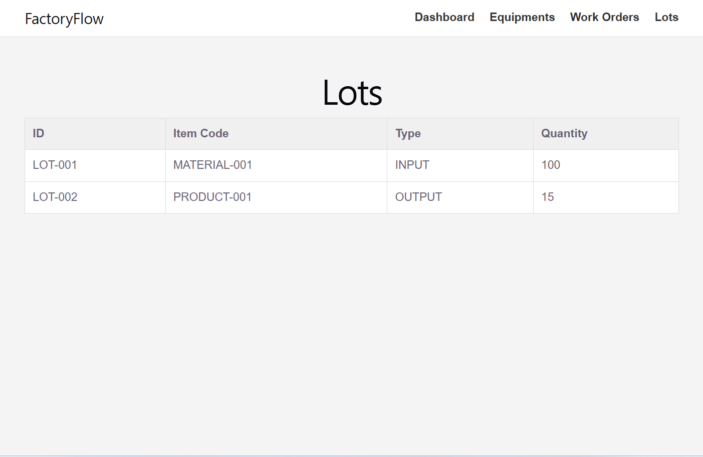

# FactoryFlow

> C++ 기반 제조 설비 데이터 수집 및 생산 관리 시스템

FactoryFlow는 제조 설비에서 발생하는 Telemetry 데이터를 **TCP 통신으로 수집하고 검증·처리하여 PostgreSQL에 저장한 뒤, C++ REST API와 React Dashboard를 통해 조회하는 End-to-End 제조 데이터 처리 시스템**입니다.

단순 CRUD 구현에 그치지 않고,

**Equipment Simulator → TCP Collector → Domain Logic → PostgreSQL → REST API → React Dashboard**

로 이어지는 전체 데이터 흐름을 직접 구현하고 실제 배포 환경까지 연결하는 것을 목표로 개발했습니다.

### 🔗 Live Demo

[FactoryFlow Dashboard](https://factory-flow-rlabd9i56-factoryflow1.vercel.app/)

---

## 🖥 Dashboard



실제 배포 환경에서 생산 및 설비 데이터를 조회할 수 있습니다.

- Total Produced
- Total Defect
- Defect Rate
- Equipment Count
- Alarm Count
- Recent Alarms

설비에서 수신한 Telemetry의 온도가 설정한 임계값 이상이면 Alarm을 생성하고 Dashboard의 Recent Alarms에서 확인할 수 있습니다.

> 현재 `90°C` 기준은 실제 산업 안전 기준이 아닌 시스템 동작 검증을 위해 설정한 데모 임계값입니다.

---

# 🏗 System Architecture

```text
┌─────────────────────────────┐
│     Equipment Simulator     │
│            C++              │
└──────────────┬──────────────┘
               │
               │ TCP / JSON
               ▼
┌─────────────────────────────┐
│     FactoryFlowCollector    │
│      C++ / Boost.Asio       │
│                             │
│     TelemetryParser         │
│            ↓                │
│     TelemetryProcessor      │
│            ↓                │
│       FactorySystem         │
│            ↓                │
│      DatabaseManager        │
└──────────────┬──────────────┘
               │
               │ libpqxx / SQL
               ▼
┌─────────────────────────────┐
│         PostgreSQL          │
│                             │
│ Equipment / WorkOrder       │
│ Production / LOT            │
│ Telemetry / Alarm           │
└──────────────┬──────────────┘
               │
               │ SELECT
               ▼
┌─────────────────────────────┐
│       FactoryFlowApi        │
│    C++ / cpp-httplib        │
└──────────────┬──────────────┘
               │
               │ HTTP / JSON
               ▼
┌─────────────────────────────┐
│       React Dashboard       │
│        React + Vite         │
└─────────────────────────────┘
```

## Deployment Architecture

```text
Local
│
└── EquipmentSimulator
          │
          │ TCP / JSON
          ▼
Railway
├── FactoryFlowCollector
│      └── TCP Proxy
│
├── FactoryFlowApi
│      └── HTTPS Public Endpoint
│
└── PostgreSQL
          │
          │ HTTP / JSON
          ▼
Vercel
└── React + Vite Dashboard
```

---

# 🔄 Data Flow

FactoryFlow의 핵심은 설비에서 생성된 데이터가 사용자 화면까지 전달되는 전체 흐름입니다.

```text
Equipment Simulator
        │
        │ Telemetry JSON 생성
        ▼
TCP Client
        │
        │ TCP Stream
        ▼
TCP Collector
        │
        ▼
TelemetryParser
        │
        │ JSON Parsing
        ▼
TelemetryProcessor
        │
        ├── Equipment 검증
        ├── WorkOrder 검증
        ├── ProductionEvent 생성
        ├── 생산 실적 처리
        └── Alarm 조건 검사
        │
        ▼
FactorySystem
        │
        ▼
DatabaseManager
        │
        │ libpqxx / Transaction
        ▼
PostgreSQL
        │
        ▼
FactoryFlowApi
        │
        │ HTTP / JSON
        ▼
React Dashboard
```

이를 통해 하나의 Telemetry가 **수신 → 파싱 → 검증 → 비즈니스 로직 처리 → DB 저장 → API 조회 → 웹 표시**까지 이어지는 과정을 구현했습니다.

---

# 📌 Main Features

## 1. Equipment Management

설비의 기본 정보와 상태를 관리합니다.

```text
STOPPED
   │
   ▼
RUNNING ──────► ERROR
   │              │
   ▼              ▼
PAUSED ───────► STOPPED
```

허용된 상태 전이만 수행할 수 있도록 도메인 로직에서 검증하며 잘못된 상태 변경을 차단합니다.

### Equipment Dashboard



Dashboard에서는 설비별 다음 정보를 조회할 수 있습니다.

- Equipment ID
- Name
- Status
- Produced Count
- Defect Count

---

## 2. Work Order Management

설비에서 수행되는 생산 작업을 Work Order 단위로 관리합니다.

- 작업지시 생성 및 조회
- Equipment와 Work Order 연결
- 작업 상태 관리
- 생산 실적과 Work Order 연계

---

## 3. Production Processing

Telemetry에서 전달된 생산 데이터를 `ProductionEvent`로 변환하여 처리합니다.

```text
Telemetry
    ↓
Equipment / WorkOrder Validation
    ↓
ProductionEvent Queue
    ↓
FactorySystem
    ↓
Production Result Update
```

생산 처리 결과에 따라 Equipment와 Work Order의 생산량 및 불량 수량을 갱신합니다.

---

## 4. LOT Traceability

원자재와 생산품을 LOT 단위로 관리하고 LOT 간 관계를 추적합니다.

```text
INPUT LOT
    │
    ▼
Production
    │
    ▼
OUTPUT LOT
```

LOT 관계에 대해 다음 기능을 구현했습니다.

- INPUT / OUTPUT LOT 관리
- LOT 관계 저장
- Forward Trace
- Backward Trace
- 재귀 기반 관계 탐색
- `visited` 검사를 통한 순환 탐색 방지

### LOT Dashboard



Dashboard에서는 LOT별 ID, Item Code, Type, Quantity를 조회할 수 있습니다.

---

## 5. TCP Telemetry Collection

Equipment Simulator가 설비 Telemetry를 JSON 형태로 생성하여 TCP Collector에 전달합니다.

```json
{
  "equipmentId": "M01",
  "workOrderId": "WO001",
  "timestamp": "2026-08-26T14:00:03",
  "status": "RUNNING",
  "temperature": 95.2,
  "vibration": 1.79,
  "productionCount": 5,
  "defectCount": 1,
  "lotId": "LOT-001"
}
```

Collector는 메시지를 수신한 후 JSON Parsing과 데이터 검증을 수행하고 유효한 데이터만 생산 처리 흐름으로 전달합니다.

---

## 6. Alarm Detection

Telemetry 처리 과정에서 온도가 설정된 임계값 이상인지 검사합니다.

```cpp
return message.getTemperature() >= 90.0;
```

조건을 만족하면 PostgreSQL에 다음 Alarm을 저장합니다.

```text
HIGH TEMPERATURE
```

저장된 Alarm은 REST API를 통해 React Dashboard에서 조회할 수 있습니다.

---

# 🌐 REST API

별도의 **C++ / cpp-httplib 기반 Read-only REST API**를 구현하여 PostgreSQL 데이터를 Frontend에 제공합니다.

```http
GET /api/health
GET /api/equipments
GET /api/work-orders
GET /api/lots
GET /api/alarms
GET /api/summary
```

React Dashboard는 API를 주기적으로 호출하여 최신 생산 현황을 표시합니다.

---

# 🗄 Database

PostgreSQL과 `libpqxx`를 이용해 연동했습니다.

주요 데이터:

```text
Equipment
WorkOrder
Production
LOT
LOT Relation
Telemetry
Alarm
```

DB 변경 작업은 transaction 단위로 처리합니다.

```cpp
pqxx::work transaction(*connection);

// SQL

transaction.commit();
```

Equipment와 Work Order의 현재 상태는 갱신하고, Telemetry와 Alarm은 이력 데이터로 저장하도록 역할을 구분했습니다.

---

# 🛠 Tech Stack

| Category | Technology | Usage |
|---|---|---|
| Language | C++17 | Domain Logic, TCP Collector, REST API |
| Networking | Boost.Asio | TCP Client / Server |
| JSON | nlohmann/json | Telemetry Serialization / Parsing |
| Database | PostgreSQL | Manufacturing Data Storage |
| DB Client | libpqxx | C++ ↔ PostgreSQL |
| REST API | cpp-httplib | Read-only HTTP API |
| Frontend | React | Dashboard UI |
| Build Tool | Vite | Frontend Build |
| Build Tool | CMake | C++ Deployment Build |
| Container | Docker | Railway Deployment |
| Hosting | Railway | Collector / API / PostgreSQL |
| Hosting | Vercel | React Dashboard |
| Version Control | Git / GitHub | Source & Version Management |
| IDE | Visual Studio / VS Code | Development |

---

# 📂 Project Structure

```text
FactoryFlow/
│
├── FactoryFlow/
│   ├── Equipment.*
│   ├── WorkOrder.*
│   ├── ProductionEvent.*
│   ├── Lot.*
│   ├── LotRelation.*
│   ├── FactorySystem.*
│   ├── TelemetryMessage.*
│   ├── TelemetryParser.*
│   ├── TelemetryProcessor.*
│   ├── TcpServer.*
│   ├── DatabaseManager.*
│   ├── FactoryFlow.cpp
│   ├── CMakeLists.txt
│   └── Dockerfile
│
├── EquipmentSimulator/
│   └── TCP Telemetry Client
│
├── FactoryFlowApi/
│   └── C++ Read-only REST API
│
├── database/
│   └── PostgreSQL Schema / SQL
│
├── factoryflow-dashboard/
│   └── React + Vite Dashboard
│
├── docs/
│   └── images/
│       ├── dashboard.png
│       ├── equipments.png
│       └── lots.png
│
└── README.md
```

---

# 🔧 Troubleshooting

프로젝트에서는 정상적인 기능 구현뿐 아니라 로컬 환경에서 작성한 여러 컴포넌트를 실제 네트워크 및 배포 환경에서 연결하는 과정까지 진행했습니다.

## 1. Railway TCP hostname 연결 실패

### Problem

로컬에서는 IP 주소를 직접 사용했지만 Railway 배포 후 TCP Proxy는 다음과 같은 hostname 형태로 제공되었습니다.

```text
altaria.proxy.rlwy.net
```

초기 TCP Client는 `make_address()`를 사용했습니다.

```cpp
boost::asio::ip::make_address(host);
```

`make_address()`는 IP 주소 문자열을 파싱하기 위한 방식이므로 hostname을 직접 처리할 수 없었습니다.

### Solution

DNS Resolver를 이용하여 hostname을 endpoint로 resolve한 뒤 TCP 연결을 수행하도록 변경했습니다.

```text
Hostname
    ↓
DNS Resolver
    ↓
Endpoint
    ↓
TCP Connection
```

### Learned

로컬 IP 기반 통신에서 실제 인터넷 환경으로 확장하면서 IP 주소와 hostname의 차이, DNS Resolution이 TCP 연결 과정에서 담당하는 역할을 확인했습니다.

---

## 2. TCP Message Framing

### Problem

TCP는 메시지 기반이 아니라 byte stream 기반이므로 한 번의 `write()`가 상대방의 한 번의 `read()`와 대응된다는 보장이 없습니다.

여러 JSON Telemetry를 연속 전송하면 서버가 각 메시지의 끝을 구분할 기준이 필요했습니다.

### Solution

각 JSON 메시지 마지막에 newline을 추가했습니다.

```cpp
string data = message + '\n';

boost::asio::write(
    socket,
    boost::asio::buffer(data)
);
```

서버는 newline을 기준으로 하나의 JSON 메시지를 읽도록 구성했습니다.

```text
JSON + \n
JSON + \n
JSON + \n
```

### Learned

TCP를 사용할 때 애플리케이션 계층에서 별도의 Message Framing 규칙을 정의해야 한다는 점을 확인했습니다.

---

## 3. Invalid JSON으로 인한 Collector 중단 방지

### Problem

네트워크 입력이 항상 정상적인 JSON이라는 보장은 없습니다.

예를 들어 다음과 같은 메시지가 전달될 수 있습니다.

```text
{ ABC
```

하나의 잘못된 메시지 때문에 Collector 전체가 종료되면 이후 정상 Telemetry까지 처리할 수 없습니다.

### Solution

JSON Parsing 실패를 하나의 메시지 처리 실패로 제한하고 이후 메시지 처리를 계속하도록 구성했습니다.

```text
Normal Telemetry
        ↓
Invalid JSON
        ↓
Unknown Equipment
        ↓
Normal Telemetry
        ↓
High Temperature
```

잘못된 JSON 이후에도 다음 정상 Telemetry가 처리되는 것을 확인했습니다.

### Learned

장시간 실행되는 서버에서는 개별 요청 실패와 프로세스 전체 실패를 분리해야 한다는 점을 확인했습니다.

---

## 4. Unknown Equipment Validation

### Problem

JSON 문법이 올바르더라도 시스템에 존재하지 않는 Equipment ID가 들어올 수 있습니다.

```json
{
  "equipmentId": "M999"
}
```

### Solution

JSON Parsing 이후 Equipment 존재 여부를 추가 검증합니다.

```text
JSON Parsing
      ↓
Equipment Validation
      │
      ├── Valid   → Process
      │
      └── Invalid → Reject
```

이를 통해 **문법적으로 올바른 데이터와 시스템에서 처리 가능한 데이터를 별도로 검증**했습니다.

---

## 5. 배포 환경에서 Frontend API 요청 실패

### Problem

로컬에서는 Dashboard와 REST API가 정상적으로 통신했지만 Vercel 배포 후 API 요청이 실패했습니다.

로컬과 배포 환경의 Backend 주소가 서로 달랐기 때문입니다.

### Solution

API 주소를 코드에 직접 고정하지 않고 Vite 환경변수로 분리했습니다.

```text
VITE_API_URL
```

Frontend에서는 다음과 같이 참조합니다.

```javascript
import.meta.env.VITE_API_URL
```

Vercel에도 배포용 환경변수를 등록한 뒤 재배포하여 실제 Backend API에 연결했습니다.

### Learned

환경별 설정값을 소스 코드와 분리해야 로컬/배포 환경 전환을 안정적으로 관리할 수 있다는 점을 확인했습니다.

---

## 6. CORS

### Problem

Frontend와 REST API가 각각 Vercel과 Railway에 배포되면서 서로 다른 Origin을 사용하게 되었습니다.

```text
Vercel Frontend
       │
       │ HTTP Request
       ▼
Railway REST API
```

브라우저의 CORS 정책으로 인해 API 요청이 차단되었습니다.

### Solution

REST API에서 배포된 Frontend Origin의 요청을 허용하도록 CORS 설정을 수정했습니다.

```text
Vercel Dashboard
       │
       │ HTTPS / JSON
       ▼
Railway REST API
       │
       ▼
PostgreSQL
```

### Learned

Backend API 자체가 정상적으로 실행되는 것과 브라우저에서 해당 API에 접근할 수 있는 것은 별개의 문제이며, 실제 웹 배포에서는 Origin 정책까지 고려해야 한다는 점을 확인했습니다.

---

# 🧪 Integration Test

정상 데이터만 확인하지 않고 오류 상황을 포함한 End-to-End 데이터 처리 테스트를 진행했습니다.

```text
[1] Normal Telemetry
        ↓
[2] Invalid JSON
        ↓
[3] Unknown Equipment
        ↓
[4] Normal Telemetry
        ↓
[5] High Temperature Telemetry
```

검증 항목:

- 정상 Telemetry Parsing
- Invalid JSON 처리
- Unknown Equipment 거부
- 오류 발생 이후 Collector 지속 동작
- Production 데이터 반영
- High Temperature 감지
- Alarm 생성
- PostgreSQL 저장
- REST API 조회
- Dashboard 표시

이를 통해 하나의 정상 요청만 처리하는 것이 아니라 **비정상 입력 이후에도 전체 데이터 파이프라인이 지속적으로 동작하는지** 확인했습니다.

---

# 🚀 Deployment

| Component | Environment |
|---|---|
| Equipment Simulator | Local Client |
| TCP Collector | Railway |
| REST API | Railway |
| PostgreSQL | Railway |
| React Dashboard | Vercel |

### Live Service

👉 [FactoryFlow Dashboard](https://factory-flow-rlabd9i56-factoryflow1.vercel.app/)

---

# 📚 What I Learned

FactoryFlow를 통해 다음 영역을 하나의 시스템으로 연결했습니다.

- C++ 객체지향 도메인 설계
- Equipment 상태 전이 검증
- Work Order / Production / LOT 관리
- 재귀 기반 LOT Traceability
- TCP Client / Server 통신
- TCP Stream Message Framing
- DNS Resolution
- JSON Serialization / Parsing
- Network Input Validation
- Production Event 처리
- PostgreSQL Transaction
- C++ REST API
- Frontend / Backend API 연동
- CORS
- 환경변수 기반 설정 관리
- CMake / Docker
- Railway / Vercel 배포
- Git / GitHub 버전 관리

프로젝트를 통해 개별 기능 구현을 넘어,

```text
Equipment
    ↓
TCP
    ↓
Backend
    ↓
Database
    ↓
REST API
    ↓
Frontend
```

로 이어지는 **데이터의 전체 생명주기를 직접 설계하고 연결하는 경험**에 중점을 두었습니다.